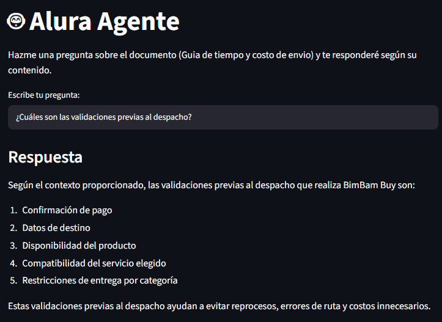

# 🤖 Alura Agente — BimBam Buy

Agente de inteligencia artificial que responde preguntas en lenguaje natural sobre los documentos internos de **BimBam Buy**, un e-commerce multiplataforma. El objetivo es que cualquier persona colaboradora pueda obtener respuestas directas sin necesidad de abrir o buscar manualmente dentro de los archivos de la empresa.

Este proyecto es el desafío final del curso, que consiste en construir un agente de IA con arquitectura RAG (Retrieval-Augmented Generation), desplegado públicamente para su uso real.

## 📄 Documento utilizado

De los documentos internos disponibles de BimBam Buy, este proyecto utiliza:

- **Guía de Tiempos y Costos de Envío de BimBam Buy.pdf**

Este documento contiene la información operativa sobre plazos de entrega, costos de envío, políticas de extravío de paquetes y validaciones logísticas previas al despacho.

## 🏗️ Arquitectura de la solución

El proyecto implementa un pipeline de **RAG (Retrieval-Augmented Generation)**:

```
PDF (documento)
   │
   ▼
Carga y extracción de texto (PyPDF)
   │
   ▼
División en chunks (LangChain Text Splitters)
   │
   ▼
Generación de embeddings (HuggingFace - sentence-transformers)
   │
   ▼
Almacenamiento en vector store (FAISS)
   │
   ▼
Retriever (búsqueda por similitud, top-k chunks relevantes)
   │
   ▼
LLM (Groq - Llama 3.3 70B) + contexto recuperado
   │
   ▼
Respuesta en lenguaje natural
   │
   ▼
Interfaz web (Streamlit)
```

**Flujo funcional:**
1. El documento PDF se carga y se divide en fragmentos (chunks) manejables.
2. Cada chunk se convierte en un vector numérico (embedding) y se almacena en una base de datos vectorial local (FAISS).
3. Cuando el usuario hace una pregunta, el sistema busca los chunks más relevantes semánticamente.
4. Esos chunks se envían como contexto al modelo de lenguaje (Groq), que genera una respuesta en lenguaje natural basada únicamente en la información del documento.
5. La respuesta se muestra en una interfaz web simple construida con Streamlit.

## 🛠️ Tecnologías y herramientas utilizadas

| Herramienta | Uso |
|---|---|
| [Python](https://www.python.org/) | Lenguaje principal del proyecto |
| [LangChain](https://www.langchain.com/) | Orquestación del pipeline RAG |
| [Groq](https://groq.com/) | Modelo de lenguaje (LLM) para generar las respuestas — gratuito y de alta velocidad |
| [PyPDF](https://pypi.org/project/pypdf/) | Lectura y extracción de texto del PDF |
| [HuggingFace / sentence-transformers](https://huggingface.co/sentence-transformers) | Generación de embeddings, ejecutados localmente sin costo |
| [FAISS](https://github.com/facebookresearch/faiss) | Vector store para almacenamiento y búsqueda por similitud |
| [Streamlit](https://streamlit.io/) | Interfaz web del agente y plataforma de deploy |

### Nota sobre el deploy

El desafío sugería usar **OCI (Oracle Cloud Infrastructure)** para el despliegue. En este proyecto se optó por **Streamlit Community Cloud** en su lugar, ya que fue la tecnología de deploy vista durante el curso y resultó más cómoda y directa de implementar, sin perder el objetivo del desafío: dejar la aplicación funcionando públicamente en la nube, accesible mediante una URL.

## 🚀 Aplicación desplegada

🔗 **URL de la app en producción:** `[pegar aquí el enlace de tu app en Streamlit Cloud]`




## ⚙️ Instrucciones para ejecutar el proyecto localmente

### 1. Clonar el repositorio

```bash
git clone https://github.com/tu-usuario/tu-repositorio.git
cd tu-repositorio
```

### 2. Crear y activar un entorno virtual

```bash
python -m venv .venv
```

En Windows:
```bash
.venv\Scripts\activate
```

En macOS/Linux:
```bash
source .venv/bin/activate
```

### 3. Instalar las dependencias

```bash
pip install -r requirements.txt
```

### 4. Configurar la API key de Groq

Crea un archivo `.env` en la raíz del proyecto con el siguiente contenido:

```
GROQ_API_KEY=tu_api_key_de_groq
```

Puedes obtener una API key gratuita en [console.groq.com](https://console.groq.com/).

### 5. Ejecutar la aplicación

```bash
streamlit run app.py
```

La aplicación se abrirá automáticamente en `http://localhost:8501`.

## 💬 Ejemplos de preguntas que el agente puede responder

Estas preguntas fueron probadas y el agente respondió correctamente en base al contenido de la Guía de Tiempos y Costos de Envío:

1. ¿Existen envíos gratis?
2. ¿Qué sucede si se extravía mi paquete?
3. ¿Qué sucede si el operador no logra entregar mi paquete?
4. ¿Cuáles son las validaciones previas al despacho?

## 📋 Ejemplos de respuestas generadas por el agente

**Pregunta:** ¿Existen envíos gratis?
**Respuesta:** `Sí, BimBam Buy puede ofrecer envío gratis bajo condiciones promocionales o por montos mínimos de compra definidos por país y campaña. Esto se mostrará antes del pago y puede aplicarse solo a categorías o regiones determinadas. Sin embargo, el envío gratuito puede tener límites de vigencia o de stock, y no necesariamente cubre reenvíos por causas atribuibles al cliente.`

**Pregunta:** ¿Qué sucede si se extravía mi paquete?
**Respuesta:** `Si se extravía su paquete, se inicia una investigación con el operador logístico y se ofrece una resolución según la evidencia disponible. Esto se describe en el punto 12.3 "Paquete extraviado" del contexto proporcionado`

**Pregunta:** ¿Qué sucede si el operador no logra entregar mi paquete?
**Respuesta:** `Si el operador no logra entregar su paquete, se considera una "Entrega fallida". En este caso, el cliente debe considerar varios factores, como el horario declarado de entrega, la necesidad de recepción por un tercero autorizado, las reglas del operador para reintentos y los posibles costos por nueva salida. Es posible que se requiera una reprogramación de la entrega. Además, si la entrega fallida se repite, se puede iniciar una investigación con el operador logístico para determinar la causa y encontrar una solución.`

**Pregunta:** ¿Cuáles son las validaciones previas al despacho?
**Respuesta:** 
```text
Según el contexto proporcionado, las validaciones previas al despacho que realiza BimBam Buy son:

Confirmación de pago
Datos de destino
Disponibilidad del producto
Compatibilidad del servicio elegido
Restricciones de entrega por categoría

Estas validaciones previas ayudan a evitar reprocesos, errores de ruta y costos innecesarios.
```

## 📁 Estructura del proyecto

```
PROYECTO/
├── Documentos/
│   └── guiaTiempoYCostoEnvio.pdf
├── .env                  # No incluido en el repositorio (ver .gitignore)
├── .gitignore
├── app.py                # Aplicación de Streamlit (interfaz + lógica RAG)
├── rag.ipynb             # Notebook de prototipado del pipeline RAG
├── requirements.txt      # Dependencias del proyecto
└── README.md
```

## 🔒 Seguridad

La API key de Groq nunca se expone en el código. En local se gestiona mediante un archivo `.env` (excluido del control de versiones vía `.gitignore`), y en el deploy se configura como *secret* en Streamlit Community Cloud.